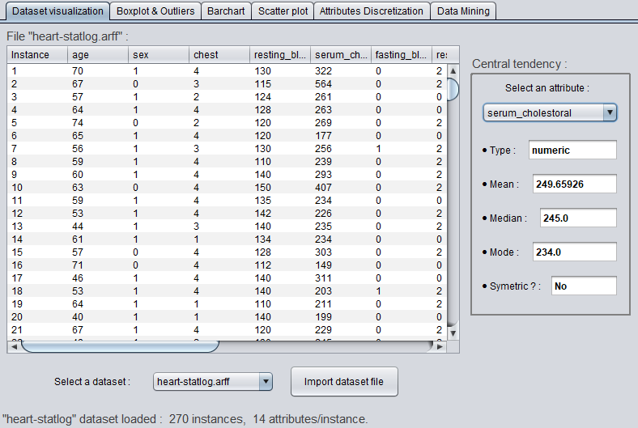
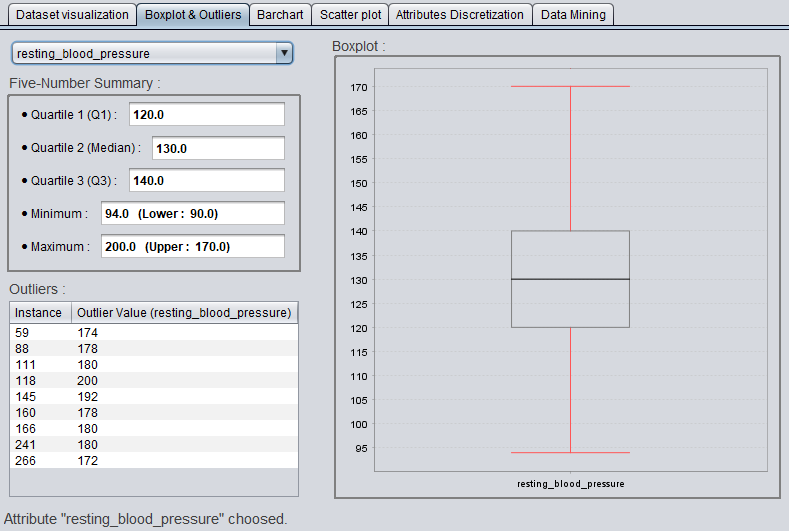
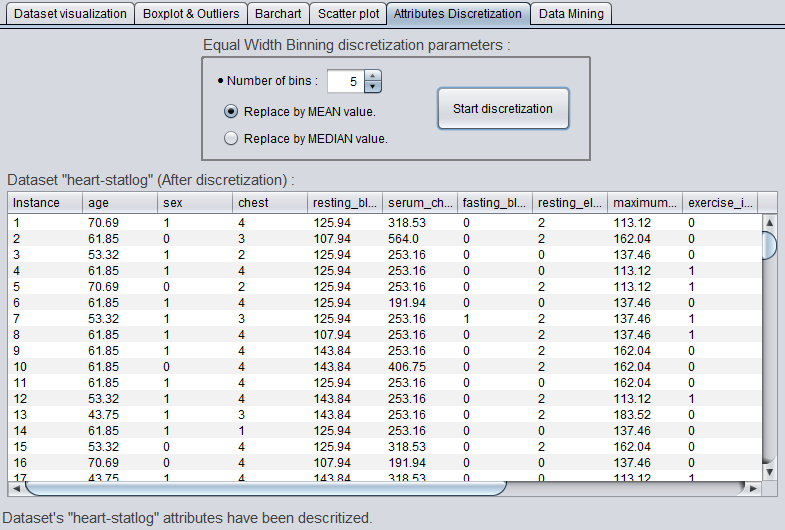
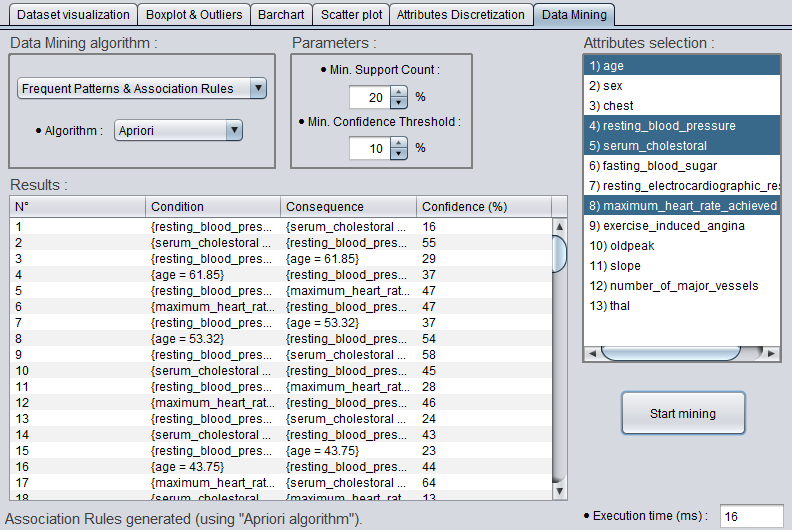
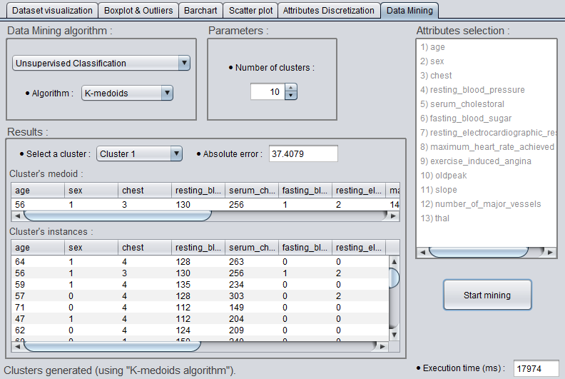

# Basic Data Miner

> A utility that groups together the different phases of Data Mining, starting with datasets visualization and their understanding by displaying various information: statistics ("central tendency" and "five-number summary") and graphs (boxplot, bar chart and scatter plot), passing through a slight data preprocessing (attributes discretization using "equal-width bining") and ending with the application of multiple Data Mining methods: frequent patterns and association rules (Apriori and Eclat) and clustering (K-medoids and CLARANS).

## General info

Project realized in **February 2020** as a university practical work, field: Artificial Intelligence (AI), Master's degree (2nd year). The goal was to manipulate in practice the different concepts related to Data Mining by developing from scratch (without using external libraries designed for Data Mining) the different algorithms for the three phases: Data visualization, their preprocessing and the application of methods for Data Mining.

## Screenshots

<p align="center">
    <p align="center">
      
    </p>
    <p align="center">
      
      
    </p>
	<p align="center">
      
      
    </p>
</p>

## Project content

```text
.
├── datasets                   <- Contains some datasets to test all application functionalities
│
├── screenshots                <- Contains images used as illustrations of the application
│
├── src                        <- Contains project's source code
│   ├── dataMining             <- Contains the different implemented techniques (from scratch) of Data Mining
│   │   ├── clustering         <- Contains cluster analysis algorithms: k-medoids and CLARANS
│   │   └── frequentPatterns   <- Contains frequent itemset mining algorithms: Apriori and Eclat
│   │
│   ├── gui                    <- Contains front end of the application and the necessary back end
│   │   ├── barchart           <- Contains the "bar chart and frequencies" section (creation and display)
│   │   ├── boxplot            <- Contains the "boxplot and outliers" section (creation and display)
│   │   ├── dataMining         <- Contains the "Data Mining" section: algorithm selection, its parameters and results display
│   │   ├── datasetImport      <- Contains the "visualization of data and basic statistics" section (dataset selection)
│   │   ├── discretization     <- Contains the "attributes discretization" section (binning method parameters)
│   │   ├── scatterplot        <- Contains the "scatter plot and correlations" section (creation and display)
│   │   └── Frame.java         <- Main frame, contains all sections and manages the interactions between them
│   │
│   ├── main                   <- Contains the main structures for the application, as well as the entry point: Application.java
│   │
│   └── jfreechart-1.5.0.jar   <- External package used for drawing graphs
│
├── Report.pdf                 <- Detailed explanation of implemented techniques and comparative graphs (in French)
│
└── README.md                  <- Current project info
```

## Technologies

- **Java** (with [JFreeChart](https://github.com/jfree/jfreechart) [Swing doesn't support graphs natively]. Used version: *JDK 8*).

## Build & Application use

Execution of this tool requires its bulding from source files including the *JFreeChart package* (as an external JAR file). With respecting of the minimum version of *JDK* used, this can be done either in the command line or directly, by importing the project, in an *IDE*. The application can be launched from the *"Application"* class in: ``"./src/main/Application.java"``.

Note that this project was developed under *Windows*, thus, some shifts in the GUI can be noticed under the OS *Linux / MacOS*.

Usage of the application itself is quite simple, the datasets are imported from the directory: ``"./datasets/"``.

## Features

- *Dataset visualization:*

  - Importing the dataset and displaying its instances: attributes and their values.
  - Presentation, for each attribute, its type and *central tendency statistics* (for "numeric" and "ordinal" types): mean, median, mode and symmetry's existence.

- *Boxplot & Outliers:*
  - Display, for numeric attributes, the *five-number summary*: quartiles 1, 2 (median) and 3 and the min / max.
  - Reporting of outliers (if they exist): number of the instance and its value.
  - Graphical representation of the associated boxplot.

- *Barchart:* Display of the barchart for a given attribute.

- *Scatter plot:* Drawing of the scatter plot associated with two attributes (one in the X axis, and the other in the Y axis).

- *Attributes Discretization:* Using the *equal-width binning* discretization method.
  - Choice of bins number.
  - Choice of replacement value: mean or median.
  - Display of the discretized dataset (its instances).

- *Data Mining:* Aapplication of different methods of data mining to the dataset.

  - *Frequents patterns & association rules:*
    - Selection of the **Apriori** or **Eclat** algorithm.
    - Parameter specification: *minimum support count* and *minimum confidence threshold*.
    - Choice of attributes to consider.
    - Display of the results: rule's number, set of the condition / consequence and the associated confidence.

  - *Unsupervised classification:*
    - Selection of the **k-medoids** or **CLARANS** algorithm.
    - Parameter specification: *number of clusters* and (only for *CLARANS*) *local minima* and *max neighbors*.
    - Display of the results: The *absolute error* and for each cluster, its medoid and instances.

  - Display of algorithms execution time.

## About

This project is free of rights. The main references consulted for its realization are:

- Data mining: concepts and techniques / Jiawei Han, Micheline Kamber, Jian Pei. – 3rd ed.
- Raymond T. Ng and Jiawei Han - CLARANS: A Method for Clustering Objects for Spatial Data Mining (2002).
